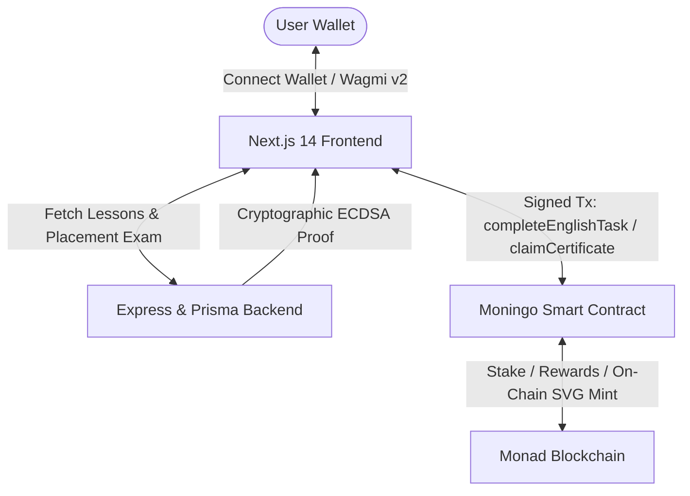

# 🦉 Moningo — Stake MON, Learn English, Earn Rewards & Mint On-Chain NFTs

[](https://monad.xyz)
[](https://nextjs.org/)
[](https://soliditylang.org/)
[](https://www.docker.com/)
[](.github/workflows/ci.yml)
[](LICENSE)

> **Moningo** is a gamified **Learn-to-Earn (L2E)** Web3 educational platform engineered natively for the **Monad Ecosystem**. Combining financial commitment with self-improvement, Moningo empowers users to stake MON, complete daily language lessons, pass placement exams, earn MON rewards, and mint verified on-chain CEFR certificate NFTs.

---

## 📸 Core Features & Platform Highlights

- ⚡ **Daily MON Micro-Staking**: Lock `0.1 MON` to activate a 24-hour daily learning streak.
- 📚 **Gamified Interactive Lessons**: Practice vocabulary, grammar, and translation exercises with an interactive owl mascot.
- 💰 **Guaranteed MON Rewards**: Complete daily lessons to reclaim your staked `0.1 MON` plus a `0.05 MON` protocol reward from the reward pool.
- 🎯 **CEFR Level Placement Exam**: Take official placement exams (`A1` through `C1`) to benchmark language proficiency.
- 📜 **On-Chain Soulbound NFT Certificates**: Mint non-transferable ERC-721 certificates embedding verified CEFR level and streak count in fully on-chain SVG artwork.
- 🔐 **Cryptographic Anti-Cheat Verification**: Off-chain lesson validation signed via backend ECDSA proofs (`taskDigest` & `examDigest`) before on-chain execution.
- 🛡️ **Replay & Double-Claim Protection**: Monad smart contract and backend database enforce strict single-signature issuance per UTC day.
- 📱 **Responsive & Accessible UI**: Built with Tailwind CSS, Radix UI primitives, dark/light themes, toasts, and micro-animations.

---

## ⚡ Why Monad Network?

Moningo is specifically designed to leverage the unique performance characteristics of **Monad**:

1. **High Throughput (10,000 TPS) & 1-Second Block Finality**: Micro-staking (`0.1 MON`) and instant reward distributions require rapid transaction finality that traditional EVM chains cannot sustain affordably.
2. **Parallel Execution Engine**: High-frequency user interactions (daily streaks, exam payments, proof submissions) execute seamlessly without network congestion.
3. **Ultra-Low Gas Fees**: Daily on-chain interactions remain economically viable for users without gas cost friction.
4. **Full EVM Compatibility**: Built using standard Solidity `0.8.20`, OpenZeppelin contracts, Wagmi v2, and Viem.

---

## 🏗 System Architecture



---

## ⚙️ Smart Contract Specification (`Moningo.sol`)

- **Daily Stake (`DAILY_STAKE`)**: `0.1 MON`
- **Reward Amount (`REWARD`)**: `0.05 MON`
- **Exam Fee (`EXAM_FEE`)**: `0.05 MON` (sent directly to the protocol reward pool)
- **CEFR Levels Supported**: `1 = A1`, `2 = A2`, `3 = B1`, `4 = B2`, `5 = C1`
- **Soulbound ERC-721**: Non-transferable certificate token (`_requireOwned`) featuring dynamically generated Base64 SVG graphics and metadata traits.

### Contract Functions Overview
- `startStreak()`: Stake `0.1 MON` to initialize a 24h streak window.
- `completeEnglishTask(bytes signature)`: Submit valid backend proof to claim staked `0.1 MON` + `0.05 MON` reward.
- `startLevelTest()`: Pay `0.05 MON` exam fee to unlock a certified level exam.
- `claimCertificate(uint8 level, bytes signature)`: Mint a soulbound CEFR certificate NFT after completing a verified exam.

---

## 🛠 Tech Stack & Frameworks

### **Frontend App (`frontend/`)**
- **Framework**: [Next.js 14 (App Router)](https://nextjs.org/) & React 18 (TypeScript)
- **Web3 Engine**: [Wagmi v2](https://wagmi.sh/), [Viem](https://viem.sh/)
- **UI & Primitives**: [Radix UI](https://www.radix-ui.com/) (Dialog, Progress, Avatar, Separator, Switch, Tabs, Tooltip), [Tailwind CSS](https://tailwindcss.com/)
- **Animations & UX**: [Framer Motion](https://www.framer.com/motion/), Lucide Icons, Next-Themes, [Sonner Toasts](https://sonner.emilkowal.ski/)

### **Smart Contracts (`contracts/`)**
- **Language**: Solidity `^0.8.20`
- **Development Tooling**: [Hardhat](https://hardhat.org/)
- **Libraries**: OpenZeppelin Contracts (ERC721, Ownable, ECDSA, MessageHashUtils, Base64, Strings)

### **Backend Service (`backend/`)**
- **Runtime**: Node.js & Express
- **Database & ORM**: [Prisma ORM](https://www.prisma.io/) (PostgreSQL / SQLite)
- **Cryptography**: Viem / Ethers.js ECDSA signing key manager

### **DevOps & Infrastructure**
- **CI / CD**: GitHub Actions Workflows (`ci.yml`, `deploy-testnet.yml`)
- **Containerization**: Docker & Multi-container Docker Compose

---

## 📁 Project Structure

```
monad-hackathon/
├── .github/
│   └── workflows/            # GitHub Actions CI & Testnet Deployment Workflows
├── backend/                  # Express REST API, Prisma ORM & Signature Engine
│   ├── prisma/               # Database Schema
│   └── src/                  # Lesson Engine, Level Exam & Chain Signer
├── contracts/                # Hardhat Project, Smart Contracts & Unit Tests
│   ├── contracts/
│   │   └── Moningo.sol       # Core Moningo Staking & NFT Contract
│   └── test/                 # Hardhat Test Suite
├── frontend/                 # Next.js 14 Web Application
│   ├── src/app/              # Dashboard, Learn Page & Placement Exam (`/exam`)
│   ├── src/components/       # UI Components, Mascot, Certificate & Wallet Modal
│   ├── src/hooks/            # Custom Wagmi Hooks (`useMoningoUser`, `useStartStreak`)
│   └── src/lib/              # Contract ABIs, Web3 Client & Error Handlers
├── docker-compose.yml        # Orchestrated Container Stack
└── README.md                 # Project Documentation
```

---

## 🚀 Local Setup & Development

### Prerequisites
- [Node.js](https://nodejs.org/) v18+ & `npm`
- MetaMask or Rabby wallet connected to Monad Testnet

---

### 1️⃣ Environment Configuration

Copy environment templates across services:

```bash
# Root environment
cp .env.example .env

# Service-specific environment files
cp frontend/.env.example frontend/.env.local
cp backend/.env.example backend/.env
cp contracts/.env.example contracts/.env
```

---

### 2️⃣ Development Workflow

#### **Smart Contracts**
```bash
cd contracts
npm install
npx hardhat compile
npx hardhat test
```

#### **Backend Service**
```bash
cd backend
npm install
npx prisma db push
npm run dev
```

#### **Frontend Application**
```bash
cd frontend
npm install
npm run dev
```
Navigate to `http://localhost:3000`.

---

### 3️⃣ Docker Compose Multi-Container Deployment

Spin up the entire stack (Backend + Frontend) with one command:

```bash
docker-compose up --build
```

- **Frontend Interface**: `http://localhost:3000`
- **Backend API**: `http://localhost:5001`

---

## 📄 License

This project is released under the [MIT License](LICENSE).
