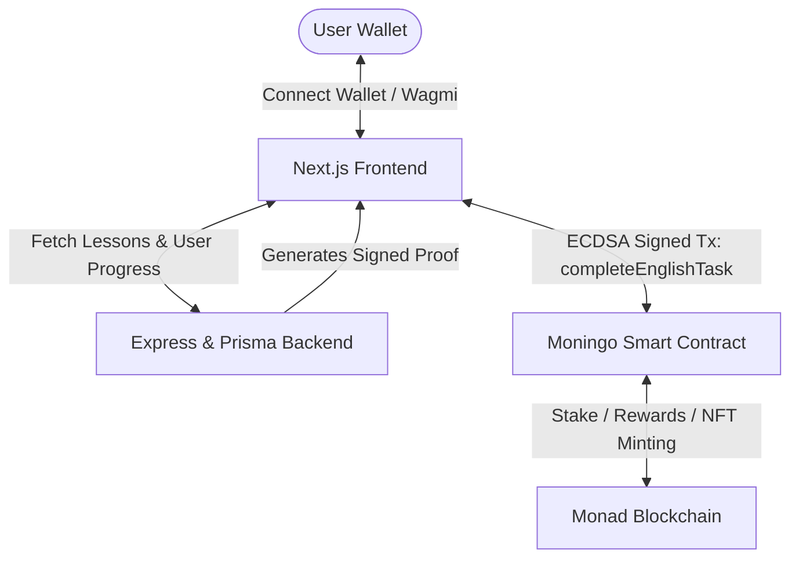

# 🦉 Moningo — Stake MON, Learn English, Earn Rewards & Mint On-Chain NFTs

[](https://monad.xyz)
[](https://nextjs.org/)
[](https://soliditylang.org/)
[](https://www.docker.com/)
[](LICENSE)

> **Moningo** is an innovative **Learn-to-Earn (L2E)** Web3 educational platform built for the **Monad Ecosystem**. Inspired by gamified learning models like Duolingo, Moningo aligns financial incentives with self-improvement by requiring users to stake MON, complete daily language lessons, earn rewards, and unlock soulbound NFT certificates.

---

## 📸 Overview & Features

- ⚡ **Daily MON Staking**: Lock `0.1 MON` to activate your daily learning streak.
- 📚 **Interactive Lessons**: Practice vocabulary, grammar, and translation exercises.
- 💰 **Earn Rewards**: Complete daily lessons to retrieve your staked `0.1 MON` plus a `0.01 MON` bonus reward.
- 📜 **On-Chain Soulbound NFT Certificates**: Reach a streak milestone (e.g., 3 days) to mint a dynamic, fully on-chain SVG ERC-721 Certificate NFT.
- 🔐 **Cryptographic Verification**: Off-chain lesson validation signed by a backend verifier via ECDSA signatures before on-chain execution.
- 📱 **Fully Responsive UI**: Optimized for all devices ranging from mobile phones (iPhone/Galaxy) to ultra-wide desktop displays.

---

## 🏗 System Architecture



---

## ⚙️ Smart Contract Mechanics (`Moningo.sol`)

- **Daily Stake**: `0.1 MON`
- **Reward Amount**: `0.01 MON`
- **Certificate Threshold**: 3 consecutive streak days
- **Soulbound NFT**: Non-transferable ERC-721 token representing verified learning achievement with dynamic SVG rendering.
- **Verification**: `completeEnglishTask(uint256 streak, bytes memory signature)` validates ECDSA signature from the trusted backend verifier address.

---

## 🛠 Tech Stack

### **Frontend**
- **Framework**: [Next.js 14 (App Router)](https://nextjs.org/) & React 18
- **Web3 Integration**: [Wagmi v2](https://wagmi.sh/), [Viem](https://viem.sh/)
- **Styling**: Tailwind CSS, Radix UI, Lucide Icons
- **Language**: TypeScript

### **Smart Contracts**
- **Language**: Solidity `^0.8.20`
- **Framework**: [Hardhat](https://hardhat.org/)
- **Libraries**: OpenZeppelin Contracts (ERC721, Ownable, ECDSA, MessageHashUtils)

### **Backend & Database**
- **Runtime**: Node.js, Express
- **ORM & DB**: Prisma ORM, PostgreSQL / SQLite
- **Crypto**: Ethers.js / Viem signature signing

### **DevOps & Infrastructure**
- Docker & Docker Compose
- Containerized Services (`frontend`, `backend`, `contracts`)

---

## 📁 Repository Structure

```
monad-hackathon/
├── backend/                  # Express API, Prisma Schema & Lesson Engine
├── contracts/                # Hardhat Solidity Smart Contracts & Deployment Scripts
│   ├── contracts/
│   │   └── Moningo.sol       # Core Moningo Stake, Reward & NFT Contract
│   └── scripts/              # Hardhat deploy & verification scripts
├── frontend/                 # Next.js 14 Web Application
│   ├── src/app/              # Next.js App Router (Dashboard, Learn Page)
│   ├── src/components/       # UI & Web3 Components (Navbar, WalletButton, StatCards)
│   ├── src/hooks/            # Custom Wagmi & API Hooks
│   └── src/lib/              # Contract ABIs, Web3 & Utility Functions
├── docker-compose.yml        # Multi-container Docker orchestration
└── README.md                 # Project Documentation
```

---

## 🚀 Quick Start Guide

### Prerequisites
- [Node.js](https://nodejs.org/) v18+ & `npm` / `pnpm`
- [Docker](https://www.docker.com/) & Docker Compose (optional, for containerized run)
- MetaMask or Rabby wallet configured for Monad Testnet

---

### 1️⃣ Environment Setup

Copy `.env.example` files in each service directory:

```bash
# Root env
cp .env.example .env

# Frontend env
cp frontend/.env.example frontend/.env.local

# Backend env
cp backend/.env.example backend/.env

# Contracts env
cp contracts/.env.example contracts/.env
```

---

### 2️⃣ Running Locally (Development Mode)

#### **Smart Contracts**
```bash
cd contracts
npm install
npx hardhat compile
# Deploy to local network or Monad testnet:
npx hardhat run scripts/deploy.js --network monadTestnet
```

#### **Backend**
```bash
cd backend
npm install
npx prisma db push
npm run dev
```

#### **Frontend**
```bash
cd frontend
npm install
npm run dev
```
Open `http://localhost:3000` in your browser.

---

### 3️⃣ Running with Docker Compose

Run the entire stack with a single command:

```bash
docker-compose up --build
```

Services exposed:
- **Frontend**: `http://localhost:3000`
- **Backend API**: `http://localhost:4000`

---

## 📱 Responsive & Mobile Support

Moningo is built mobile-first using Tailwind CSS. Test viewport compatibility using the included script:

```bash
./.roo/skills/monad-hackathon-development/scripts/check-responsive.sh
```

---

## 🏆 Monad Blitz İstanbul Hackathon

Developed during **Monad Blitz İstanbul (Sept 2026)** as a rapid prototype exploring high-throughput Web3 micro-transactions, gamified staking, and on-chain verification on the **Monad Blockchain**.

---

## 📄 License

This project is licensed under the MIT License - see the [LICENSE](LICENSE) file for details.
