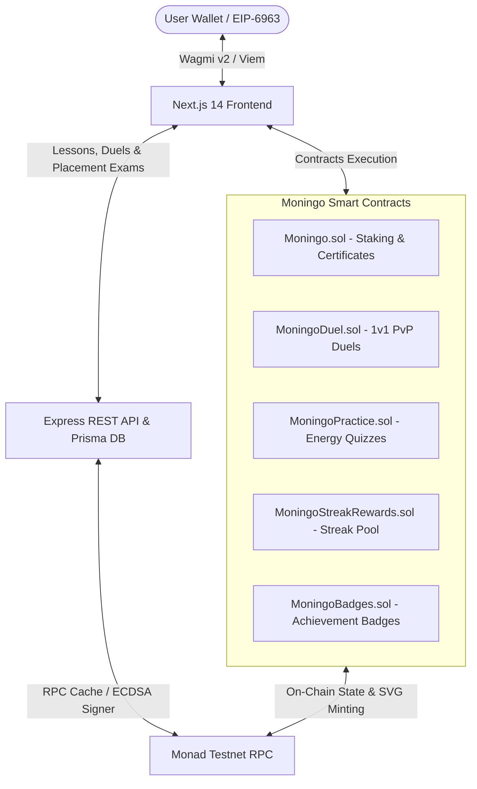

# 🦉 Moningo — Gamified Learn-to-Earn Platform on Monad

<div align="center">
  
  <h3>Learn English, Stake MON, Compete in Duels & Mint On-Chain Certificates</h3>
</div>

<div align="center">

[-8A2BE2?style=for-the-badge&logo=ethereum)](https://monad.xyz)
[](https://nextjs.org/)
[](https://soliditylang.org/)
[](https://www.docker.com/)
[](.github/workflows/ci.yml)
[](LICENSE)

</div>

---

> **Moningo** is an end-to-end, gamified **Learn-to-Earn (L2E)** Web3 educational ecosystem engineered natively for the **Monad Blockchain**. Blending financial motivation with daily language acquisition, Moningo enables users to stake MON, practice daily vocabulary, challenge players in 1v1 PvP duels, pass certified placement exams, collect achievement badges, and mint fully on-chain CEFR NFT certificates.

---

## ⚡ Monad Technology & Architecture Integration

Moningo is architected from the ground up to exploit the unique high-performance capabilities of the **Monad Ecosystem**:

### 1. **High Throughput (10,000 TPS) & 1-Second Block Finality**
Micro-rewards (`0.05 MON`), 1v1 PvP staking, and daily streak transactions require instant finality. Monad’s 1-second block time ensures instant feedback when completing lessons or claiming rewards.

### 2. **Gasless Sponsored Claims (`completeDailyFor`)**
To eliminate onboarding gas friction for students, Moningo implements a verifier-sponsored claim protocol (`Moningo.completeDailyFor`). The backend verifier submits proof and pays transaction gas on Monad, allowing students to claim rewards gaslessly.

### 3. **Monad Parallel Execution Engine**
High-frequency concurrent player activities—such as simultaneous 1v1 PvP duels (`MoningoDuel.sol`), micro-practice quizzes (`MoningoPractice.sol`), and badge minting (`MoningoBadges.sol`)—execute in parallel without state locking or transaction queuing.

### 4. **Resilient RPC Caching & Rate-Limit Protection**
To operate smoothly under Monad Testnet public RPC rate limits (~15 req/s), the backend features:
- In-memory request deduplication for concurrent reads.
- Short TTL read caching (4s for user state, 15s for reward pool).
- `stale-if-error` fallback logic serving cached states during transient RPC outages.

### 5. **On-Chain Dynamic SVG Rendering**
Smart contracts (`Moningo.sol`, `MoningoBadges.sol`, `MoningoStreakRewards.sol`) generate dynamic Base64-encoded SVG artwork directly on Monad. Certificate levels (`A1`–`C1`), streak counts, and badge traits are embedded straight into on-chain state without external IPFS dependencies.

### 6. **Custom Monad Wallet Integration (`add-to-wallet.tsx`)**
Built-in wallet management supporting EIP-6963 multi-injected discovery (MetaMask, Rabby, Coinbase Wallet) with one-click automatic Monad Testnet RPC & network addition.

---

## 📸 Core Features & Educational Modules

- 🦉 **Interactive Owl Mascot**: An expressive animated mascot guiding learners through lessons, feedback, and combo streaks.
- 📚 **Daily Quests & Micro-Staking**: Stake `0.1 MON` daily to unlock 24-hour learning streaks and earn guaranteed MON returns plus streak growth bonuses.
- ⚔️ **1v1 PvP Language Duels (`/duel`)**: Challenge other learners in real-time or async 1v1 English duels backed by `MoningoDuel.sol` smart contract stakes.
- 🎯 **CEFR Placement Exam (`/exam`)**: Take official level exams (`A1` to `C1`) with cryptographic backend signature verification (`examDigest`).
- 📜 **On-Chain CEFR Certificate NFTs**: Mint non-transferable ERC-721 certificates featuring dynamic Base64 SVG graphics rendering verified proficiency.
- ⚡ **Energy-Based Micro-Practice (`/practice`)**: Earn bonus XP and MON through practice levels governed by energy regeneration timers and `MoningoPractice.sol`.
- 🍇 **Fruit Tree Streak Rewards (`/streak`)**: Milestone reward tree allowing users to harvest MON bonuses at day 3, 7, 14, and 30 streaks (`MoningoStreakRewards.sol`).
- 🏆 **Achievements & Badges (`/profile`)**: Collect on-chain achievement badges (`MoningoBadges.sol`) for milestones, win streaks, and perfect exam scores.
- 🔍 **Public Certificate Verification (`/verify`)**: Open verification portal to validate any Moningo certificate token ID directly on Monad.

---

## 🏗 System Architecture



---

## ⚙️ Smart Contract Ecosystem

| Contract | Description | Standard |
| :--- | :--- | :--- |
| **`Moningo.sol`** | Core daily streak staking (`0.1 MON`), sponsored claim (`completeDailyFor`), CEFR placement exam, and Base64 SVG Certificate minting. | ERC-721, Ownable, ECDSA |
| **`MoningoDuel.sol`** | 1v1 PvP duel matchmaking, stake escrow, turn verification, and winner reward payout. | Custom Escrow, ECDSA |
| **`MoningoPractice.sol`** | Energy-based practice quiz tracking, checkpoint signature validation, and XP multiplier engine. | Custom State Engine |
| **`MoningoStreakRewards.sol`** | Milestone bonus pool distribution (`3-day`, `7-day`, `30-day` rewards). | Ownable, Vault |
| **`MoningoBadges.sol`** | Dynamic on-chain achievement badges with custom SVG graphics. | ERC-1155 / ERC-721 |

---

## 🛠 Tech Stack & Frameworks

### **Frontend Stack (`frontend/`)**
- **Framework**: [Next.js 14 (App Router)](https://nextjs.org/) & React 18 (TypeScript)
- **Web3 Layer**: [Wagmi v2](https://wagmi.sh/), [Viem](https://viem.sh/), EIP-6963 Wallet Discovery
- **UI Primitives**: [Radix UI](https://www.radix-ui.com/) (Dialog, Progress, Avatar, Separator, Switch, Tabs, Tooltip), [Tailwind CSS](https://tailwindcss.com/)
- **State & UX**: [TanStack Query v5](https://tanstack.com/query), [Framer Motion](https://www.framer.com/motion/), Lucide Icons, Next-Themes, [Sonner Toasts](https://sonner.emilkowal.ski/)

### **Smart Contract Stack (`contracts/`)**
- **Language**: Solidity `^0.8.20`
- **Tooling**: [Hardhat](https://hardhat.org/) & Hardhat Toolbox
- **Libraries**: OpenZeppelin Contracts (ERC721, Ownable, ECDSA, MessageHashUtils, Base64, Strings)

### **Backend Stack (`backend/`)**
- **Runtime**: Node.js, Express.js
- **Database & ORM**: [Prisma ORM](https://www.prisma.io/) (PostgreSQL / SQLite)
- **Chain Integration**: Viem / Ethers.js ECDSA Signer & RPC Cache Layer

### **DevOps & Infrastructure**
- **CI / CD**: GitHub Actions Workflows (`ci.yml`, `deploy-testnet.yml`)
- **Containers**: Multi-container Docker & Docker Compose setup

---

## 📁 Repository Structure

```
monad-hackathon/
├── .github/
│   └── workflows/            # GitHub Actions CI & Testnet Deployment
├── backend/                  # Express REST API, Prisma ORM, RPC Cache & Game Engine
│   ├── prisma/               # Database Schema
│   ├── scripts/              # API Smoke Test Scripts
│   ├── src/                  # Lessons, Duels, Practice, Achievements & Signer
│   └── test/                 # Backend API Unit & Integration Tests
├── contracts/                # Hardhat Project & Smart Contracts
│   ├── contracts/            # Moningo.sol, Duel, Practice, Badges & Streak Contracts
│   ├── scripts/              # Deployment Scripts (`deploy.js`, `deploy-games.js`, etc.)
│   └── test/                 # Hardhat Contract Unit Tests
├── frontend/                 # Next.js 14 Web Application
│   ├── src/app/              # App Router Pages (Dashboard, Learn, Exam, Duel, Practice, Profile, Verify)
│   ├── src/components/       # Mascot, Wallet Modal, Certificate, Badges & UI Primitives
│   ├── src/hooks/            # Custom Wagmi Hooks (`useMoningoUser`, `useStartStreak`, `useDuel`)
│   └── src/lib/              # Contract ABIs, Viem Client, Error Handlers & Toast Helpers
├── docker-compose.yml        # Multi-service Container Configuration
└── README.md                 # Project Documentation
```

---

## 🚀 Quick Start Guide

### Prerequisites
- [Node.js](https://nodejs.org/) v18+ & `npm`
- MetaMask or Rabby wallet configured for Monad Testnet

---

### 1️⃣ Environment Configuration

Copy environment templates:

```bash
# Root environment
cp .env.example .env

# Service-specific environment files
cp frontend/.env.example frontend/.env.local
cp backend/.env.example backend/.env
cp contracts/.env.example contracts/.env
```

---

### 2️⃣ Development Workflow

#### **Smart Contracts**
```bash
cd contracts
npm install
npx hardhat compile
npx hardhat test
```

#### **Backend Service**
```bash
cd backend
npm install
npx prisma db push
npm run dev
```

#### **Frontend Application**
```bash
cd frontend
npm install
npm run dev
```
Navigate to `http://localhost:3000`.

---

### 3️⃣ Docker Compose Multi-Container Run

```bash
docker-compose up --build
```

- **Frontend Interface**: `http://localhost:3000`
- **Backend API**: `http://localhost:5001`

---

## 📄 License

This project is released under the [MIT License](LICENSE).
